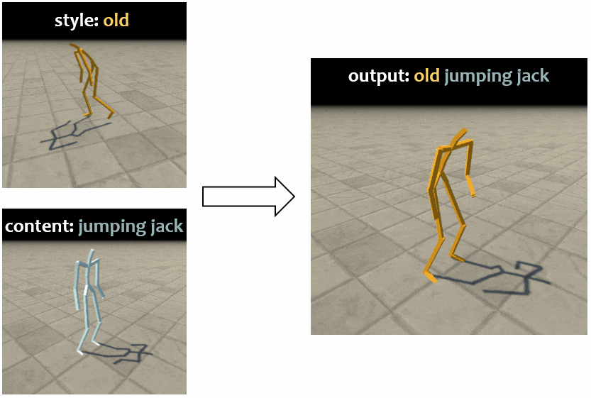

## Semi-supervised Motion Style Transfer



### Installation

```
pip install -r requirements.txt
```


### Quick Start

```
python run.py --con ./m21_data/content/jumping-jack.bvh --sty ./m21_data/style/OLD-2.bvh
```

The original output .bvh file is at ./output/original/OLD-2_jumping-jack.bvh

The foot sliding removed one is at ./output/remove_fs/OLD-2_jumping-jack.bvh

More examples:

```
python run.py --con ./m21_data/content/hop.bvh --sty ./m21_data/style/STR-1.bvh
```


### Acknowledgments

The implementation of graph neural network in this repository is from the following repository:

https://github.com/DK-Jang/motion_puzzle

Also thanks the following teams who provide mocap data: 

CMU dataset: http://mocap.cs.cmu.edu/  and  https://github.com/una-dinosauria/cmu-mocap

BFA dataset: https://github.com/DeepMotionEditing/deep-motion-editing

XIA dataset: https://github.com/DeepMotionEditing/deep-motion-editing and http://faculty.cs.tamu.edu/jchai/projects/SIG15/style-final.pdf
